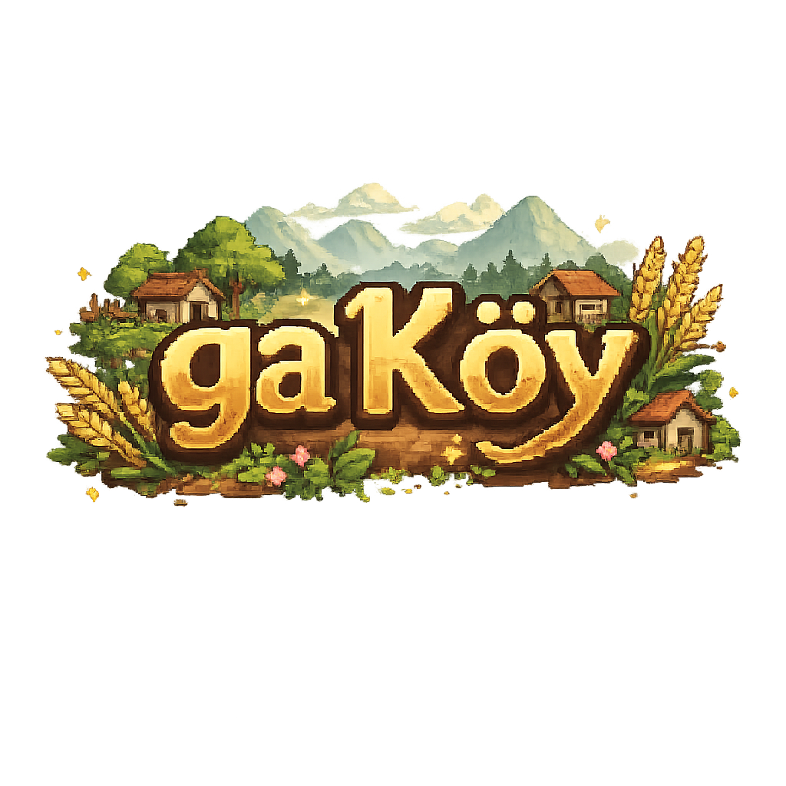

<div align="center">
  

  # ga Köy

  > Söylentiye göre dağların derinliklerinde, dünyadan kopuk bir köy var — ga Köy.
  > Burada dört mevsim belirgin yaşanır, insanlar sade ve içten bir hayat sürer.
  > Ama son yıllarda gençler birer birer köyden ayrılmış, köy giderek sessizleşmiştir.
  > Bir gün, vefat eden büyükbabandan bir mektup alırsın. Zarfın içinden eski bir bakır anahtar ve sararmış bir tapu çıkar…

  Stardew Valley’den ilham alan, metin tabanlı bir çiftlik ve köy yaşamı simülasyonu. Piksel tarzı görsellerle hazırlanmıştır. Tamamen istemci tarafında çalışır, ek sunucu gerektirmez.

  [](https://github.com/setube/taoyuan/releases/latest)
  [](https://creativecommons.org/licenses/by-nc/4.0)
  [](https://www.taptap.cn/app/816558)
  [](https://hellogithub.com/repository/e73a691ffcfa4d0e92a05912fe8c0b46)
</div>

## Oyun Özellikleri

**Karakter Oluşturma** — İsmini gir, cinsiyetini seç. 6 farklı çiftlik başlangıcı kendine özgü avantajlar sunar (dere kenarında balıkçılık bonusu, bambulukta toplama bonusu, tepelerde madencilik bonusu gibi). NPC’ler seçtiğin cinsiyete göre sana farklı hitap eder.

**Dört Mevsim Döngüsü** — İlkbahar, yaz, sonbahar ve kış döngüsüyle ilerleyen bir oyun yapısı. Her mevsim 28 gün sürer. Gün içinde saat akışı vardır (06:00 - ertesi gün 02:00). Altı farklı hava durumu bulunur: açık, yağmurlu, fırtınalı, karlı, rüzgarlı ve yeşil yağmur.

**Çiftlik Yönetimi** — 38 farklı ürün dört mevsim boyunca ekilip biçilebilir. Tarlan 4×4’ten başlayıp 8×8’e kadar büyütülebilir. 3 tür sulayıcı otomatik sulama sağlar, 6 tür gübre kaliteyi artırır. Sera kurarak her mevsim ekim yapabilir, 8 tür meyve ağacından her 28 günde bir ürün alabilirsin.

**Hayvancılık** — Kümes hayvanları (tavuk, ördek, tavşan, kaz, bıldırcın, güvercin, ipek tavuk, tavus kuşu) ve ahır hayvanları (inek, koyun, keçi, manda, yak, alpaka, geyik, devekuşu, deve, sığın, eşek) dahil toplam 19 hayvan türü bulunur. Barınaklar 3 seviyeye kadar yükseltilebilir.

**Yetenek Gelişimi** — Tarım, toplama, balıkçılık ve madencilik olmak üzere dört ana beceri vardır. 5. ve 10. seviyelerde uzmanlık seçimleri açılır.

**Köy Sosyalliği** — 34 köylüyle etkileşim kurabilir, bunların 12’siyle evlenebilirsin. Hediye ver, sohbet et, kalp etkinliklerini tetikle, evlenip yuva kur. Eşin sana çiftlik işlerinde yardımcı olabilir. Ayrıca 6 gizli ruhani NPC vardır (Ejderha Ruhu, Tao Ruhu, Ay Tavşanı, Tilki Ruhu, Dağ Bilgesi, Geri Dönen Kız). Bunların kendine ait keşif zincirleri, bağ sistemi ve özel ödülleri vardır.

**Balıkçılık Sistemi** — 6 farklı balık avlama noktası vardır (dere, gölet, nehir, yeraltı nehri, şelale, bataklık). Toplam 60 balık türü bulunur. Gerçek zamanlı mini oyunda oltanın yüksekliğini basılı tutarak ayarlarsın; göstergeyi tutturursan av başarılı olur. Yem, şamandıra, yengeç kapanı ve yağmurlu havada altın arama gibi ek sistemler de vardır.

**Balık Havuzu** — Balık yavruları bırakıp havuzda yetiştirebilir, her gün yan ürün alabilir ve çoğalmalarını sağlayabilirsin.

**Maden Macerası** — Bulut Gizli Mağarası toplam 120 kattan oluşur (yüzey, don, lav, kristal, gölge ve uçurum katmanları). Her 20 katta bir boss savaşı vardır. Sıra tabanlı savaş sistemi kullanılır. Tamamlandığında İskelet Madeni açılır.

**Hanhai Çölü** — Madenlerin ötesinde yer alan ileri seviye macera bölgesi. Daha nadir kaynaklar ve daha güçlü düşmanlar bulunur.

**Yemek Pişirme** — 113 tarif vardır. Hazırlanan yemekler enerji ve can yeniler, ayrıca günlük güçlendirmeler sağlar.

**İşleme ve Üretim** — 21 farklı üretim makinesi bulunur (şaraphane, sos küpü, yağ atölyesi, fırın, dokuma tezgahı, çay makinesi, ilaç öğütücüsü vb.). 150’den fazla işleme tarifi vardır.

**Sandık ve Depolama** — 5 farklı malzemeden sandık vardır (tahta, bakır, demir, altın, boşluk). Eşyalar kategorilere göre depolanabilir. Boşluk sandığı uzaktan erişimi destekler; hammadde ve ürün sandığı olarak atanarak atölye otomasyonunda kullanılabilir.

**Tohum Geliştirme Sistemi** — Tohum makinesiyle özel üretim tohumları elde edilir. Melezleme yoluyla yeni ürün türleri yetiştirilebilir. 10 nesle yayılan 400 farklı çaprazlama tarifi vardır.

**Macera Loncası** — 21 farklı av hedefi vardır. Canavar öldürdükçe ün kazanır, yeni ödüller açarsın.

**Müze Koleksiyonu** — Madenler, eserler ve ruhani eşyalar bağışlanabilir. Koleksiyon tamamlandığında özel ödüller açılır.

**Ekipman Sistemi** — Silahlar, şapkalar, ayakkabılar ve yüzükler bulunur. Set bonusları ek avantaj sağlar.

**Görevler ve Başarımlar** — 5 bölüm ve 50 ana hikâye görevi, günlük görevler (teslimat, balıkçılık, madencilik, toplama), 20 topluluk görev paketi ve tüm oynanışı kapsayan 109 başarı vardır.

**Prosedürel Müzik** — Tone.js ile gerçek zamanlı olarak Çin beşli dizisine dayalı müzikler üretilir. 19 farklı arka plan müziği (mevsimler, festivaller, mini oyunlar, savaşlar, Hanhai) ve 80’den fazla ses efekti vardır. Hava durumu ve günün saati müziğin tonunu ve ritmini dinamik olarak etkiler.

## Oyun Ekran Görüntüleri


## Hızlı Başlangıç

```bash
# Bağımlılıkları yükle
pnpm install

# Geliştirme sunucusunu başlat
pnpm dev

# Tür kontrolü + üretim derlemesi
pnpm build

# Derleme çıktısını önizle
pnpm preview

# Electron masaüstü sürümünü derle
pnpm build:electron